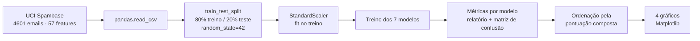

[← README](../README.md) · [Resultados](resultados.md) · **Metodologia** · [Guia de uso](guia-de-uso.md)

# Metodologia

## Pipeline

O notebook `ml_spam_email.ipynb` executa o pipeline em cinco etapas:

| Célula | Etapa | O que faz |
|:-:|---|---|
| 1 | Imports | pandas, NumPy, Matplotlib e scikit-learn |
| 2 | Dados | Baixa o Spambase, nomeia as 58 colunas, separa `X` (57 features) e `y` (`label`), divide 80/20 e normaliza |
| 3 | Treino e avaliação | Treina cada modelo do dicionário `models` e guarda as métricas em `results` |
| 4 | Relatório | Ordena `results` pela pontuação composta e imprime relatório e matriz de confusão |
| 5–9 | Visualização | Gera os gráficos de acurácia, precisão/recall/F1, TPR/TNR e pontuação composta |

## Dataset

O [Spambase](https://archive.ics.uci.edu/dataset/94/spambase) foi criado pelo
Hewlett-Packard Labs. São 4.601 emails com 57 features numéricas e um rótulo binário
(`1` = spam, `0` = não spam). As features se dividem em três grupos:

| Grupo | Colunas | Exemplo |
|---|:-:|---|
| Frequência de palavras | 48 | `word_freq_free`, `word_freq_money`, `word_freq_remove` |
| Frequência de caracteres | 6 | `char_freq_!`, `char_freq_$` |
| Sequências em caixa alta | 3 | `capital_run_length_average`, `capital_run_length_longest`, `capital_run_length_total` |

O estudo usa **todas** as 57 features.

## Decisões de projeto

- **Normalização com `StandardScaler`:** SVM, KNN e MLP são sensíveis à escala das features.
  O scaler é ajustado só no treino (`fit_transform`) e aplicado no teste (`transform`),
  sem vazamento de dados.
- **Sementes fixas:** `random_state=42` na divisão treino/teste e nos modelos com etapas
  aleatórias (Árvore de Decisão, Random Forest e Rede Neural). Toda execução produz os
  mesmos resultados.
- **Hiperparâmetros padrão:** o foco é comparar os algoritmos em condições equivalentes,
  sem tuning individual.

## Modelos e hiperparâmetros

| Modelo | Classe scikit-learn | Parâmetros |
|---|---|---|
| Naive Bayes | `GaussianNB` | padrão |
| Regressão Logística | `LogisticRegression` | `max_iter=1000` |
| Árvore de Decisão | `DecisionTreeClassifier` | `random_state=42` |
| Random Forest | `RandomForestClassifier` | `random_state=42` |
| Support Vector Machine | `SVC` | padrão (kernel RBF) |
| K-Nearest Neighbors | `KNeighborsClassifier` | padrão (`k=5`) |
| Rede Neural | `MLPClassifier` | `hidden_layer_sizes=(12, 8)`, `max_iter=1000`, `random_state=42` |

## Métricas de avaliação

Com a matriz de confusão `TN, FP, FN, TP = confusion_matrix(y_test, y_pred).ravel()`,
onde a classe positiva é **spam**:

| Métrica | Fórmula | Pergunta que responde |
|---|---|---|
| Acurácia | $(TP + TN) / total$ | Quantos emails o modelo acertou? |
| Precisão | $TP / (TP + FP)$ | Dos marcados como spam, quantos eram spam? |
| Recall | $TP / (TP + FN)$ | De todo o spam, quanto o modelo pegou? |
| F1-score | $2 \cdot \frac{P \cdot R}{P + R}$ | Equilíbrio entre precisão e recall |
| TPR | $TP / (TP + FN)$ | Taxa de spam detectado |
| TNR | $TN / (TN + FP)$ | Taxa de emails legítimos preservados |

Precisão, recall e F1 usam a média ponderada (`weighted avg`) do `classification_report`.

### Pontuação composta

Média simples das seis métricas, todas em escala 0–100:

$$
\text{composta} = \frac{\text{acurácia} + \text{precisão} + \text{recall} + \text{F1} + \text{TPR} + \text{TNR}}{6}
$$

A fundamentação teórica de cada algoritmo está no
[artigo](../email-spam-classifier-benchmark.pdf).
