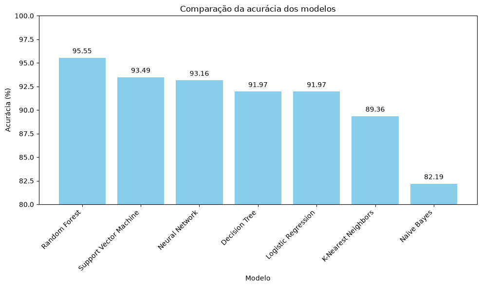
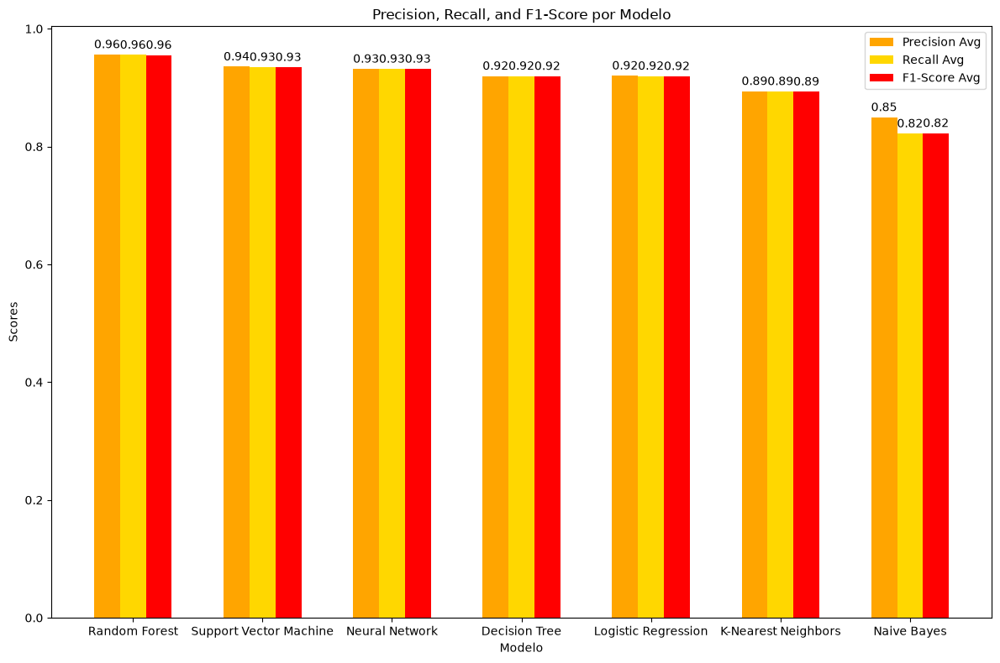
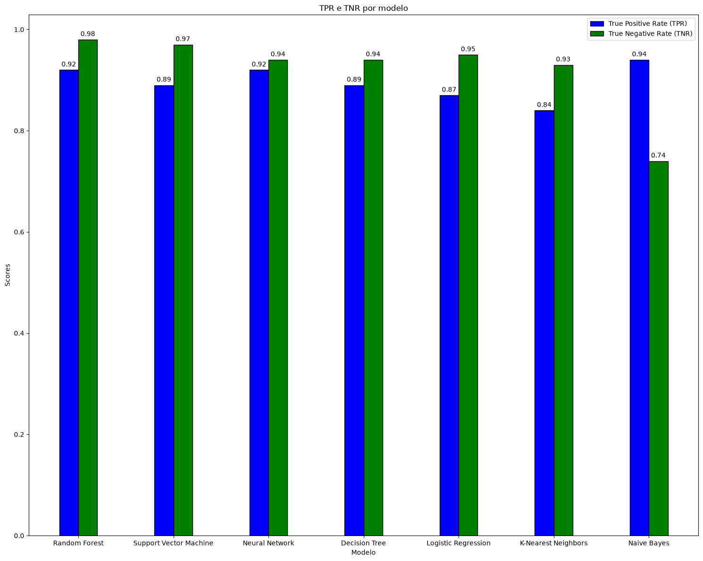
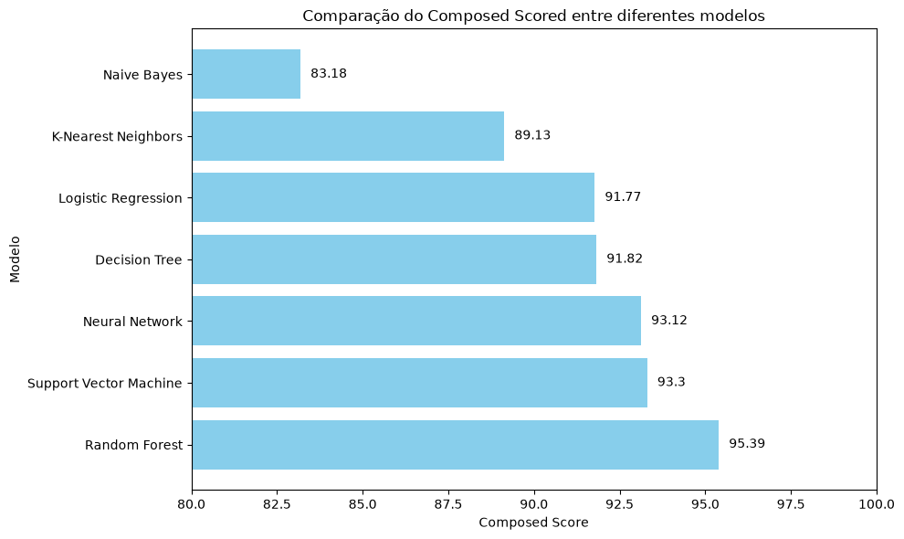

[← README](../README.md) · **Resultados** · [Metodologia](metodologia.md) · [Guia de uso](guia-de-uso.md)

# Resultados

Conjunto de teste: **921 emails** (531 não spam, 390 spam). Modelos ordenados pela
pontuação composta. As métricas estão explicadas em [Metodologia](metodologia.md#métricas-de-avaliação).

| # | Modelo | Acurácia | Precisão¹ | Recall¹ | F1¹ | TPR (spam) | TNR (não spam) | Pontuação composta |
|:-:|--------|:--------:|:---------:|:-------:|:---:|:----------:|:--------------:|:------------------:|
| 🥇 | **Random Forest** | **95,55%** | **0,956** | **0,955** | **0,955** | 0,918 | **0,983** | **95,39** |
| 🥈 | Support Vector Machine | 93,49% | 0,936 | 0,935 | 0,935 | 0,892 | 0,966 | 93,30 |
| 🥉 | Rede Neural (MLP) | 93,16% | 0,932 | 0,932 | 0,932 | 0,923 | 0,938 | 93,12 |
| 4 | Árvore de Decisão | 91,97% | 0,920 | 0,920 | 0,919 | 0,887 | 0,944 | 91,82 |
| 5 | Regressão Logística | 91,97% | 0,920 | 0,920 | 0,919 | 0,874 | 0,953 | 91,77 |
| 6 | K-Nearest Neighbors | 89,36% | 0,894 | 0,894 | 0,893 | 0,844 | 0,930 | 89,13 |
| 7 | Naive Bayes | 82,19% | 0,849 | 0,822 | 0,823 | **0,938** | 0,736 | 83,18 |

¹ Média ponderada (`weighted avg`) entre as duas classes.

## Leitura dos resultados

- **Random Forest** lidera em quase todas as métricas e deixa passar só 9 falsos positivos
  (emails legítimos marcados como spam).
- **Naive Bayes** tem a menor acurácia, mas o **maior TPR**: captura 93,8% do spam, ao custo
  de classificar 140 emails legítimos como spam. Só compensa quando deixar spam passar custa
  mais do que perder email legítimo.
- **SVM** e **Rede Neural** ficam próximos do líder e são alternativas viáveis. A Rede Neural
  tem o segundo maior TPR (92,3%).

## Gráficos

| Acurácia | Precisão, recall e F1 |
|:-:|:-:|
|  |  |
| **TPR e TNR** | **Pontuação composta** |
|  |  |

## Matrizes de confusão

Linhas são a classe real; colunas, a classe prevista.

| Modelo | Não spam → não spam (TN) | Não spam → spam (FP) | Spam → não spam (FN) | Spam → spam (TP) |
|---|:-:|:-:|:-:|:-:|
| Random Forest | 522 | **9** | 32 | 358 |
| Support Vector Machine | 513 | 18 | 42 | 348 |
| Rede Neural (MLP) | 498 | 33 | 30 | 360 |
| Árvore de Decisão | 501 | 30 | 44 | 346 |
| Regressão Logística | 506 | 25 | 49 | 341 |
| K-Nearest Neighbors | 494 | 37 | 61 | 329 |
| Naive Bayes | 391 | 140 | **24** | 366 |

**FP** é o erro mais caro para o usuário: um email legítimo vai para a caixa de spam.
**FN** é spam que chega à caixa de entrada.

## Reprodutibilidade

Todos os modelos com etapas aleatórias usam `random_state=42`, então a tabela, as matrizes
e os gráficos vêm da mesma execução e se repetem. Os números foram gerados com scikit-learn
1.9.1, pandas 3.0.6, NumPy 2.5.3 e Matplotlib 3.11.2. Outras versões podem produzir
diferenças pequenas.
